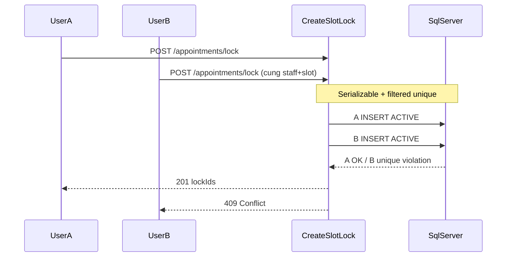

# Báo cáo: Hardening Booking 1-Winner (Phương án A — không bảng mới)

Ngày: 2026-07-16  
Liên quan: [BOOKING-SLOT-LOCK-FLOW.md](./BOOKING-SLOT-LOCK-FLOW.md)

---

## 1. Mục tiêu đã triển khai

| Mục tiêu | Kết quả |
|---|---|
| Không thêm bảng mới | Chỉ nâng index trên `appointment_slot_locks` |
| 1 winner khi 2 user lock cùng staff + start slot (cách vài ms) | Filtered UNIQUE + `Serializable` + map unique → Conflict |
| Multi-slot chồng (vd 60′ @14:00 vs 30′ @14:30) | `Serializable` + re-check `ResolveStaffAsync` trong TX |
| Soft lock hết hạn nhả unique | Quartz `CleanupExpiredSlotLocksJob` → `STATUS_EXPIRED` |
| Confirm không tin lock mù | `CreateAppointment` luôn re-validate (`excludeLockId`) |
| Chịu tải salon ~100 user | Đủ; deadlock retry tối đa 2 lần |

---

## 2. Thay đổi kỹ thuật

### 2.1 Schema (Database First)

Script tay: [`.agent/sql/002_ux_slot_lock_active_start.sql`](../../../../../../.agent/sql/002_ux_slot_lock_active_start.sql)

```sql
CREATE UNIQUE INDEX UX_slot_lock_active_staff_date_slot
ON appointment_slot_locks (staff_id, appointment_date, slot_id)
WHERE status = 1; -- ACTIVE
```

- Drop index cũ non-unique `ix_slot_locks_staff_date_slot`.
- Schema gốc v1 đã cập nhật tương ứng trong `lotus-spa-schema-v1.sql`.
- EF: `AppointmentSlotLockConfiguration` — `HasIndex(...).IsUnique().HasFilter("status = 1")`.

**Vì sao Quartz bắt buộc:** Availability bỏ qua `ExpiresAt <= now`, nhưng filtered unique **vẫn khóa** nếu `status` còn `ACTIVE` → job phải `ACTIVE → EXPIRED` để nhả chỗ sau TTL 10 phút.

### 2.2 CreateSlotLock

- TX **Serializable**.
- Trong TX gọi lại `ResolveStaffAsync` rồi INSERT.
- `DbUpdateException` unique (2601/2627) → `409 Conflict` + message rõ.
- Deadlock (1205) → retry ≤ 2 lần rồi Conflict.

### 2.3 CreateAppointment

- TX **Serializable**.
- Có `LockId` hợp lệ: vẫn `ResolveStaffAsync(..., excludeLockId: lock.Id)` — bỏ qua chính lock đang confirm để không tự chặn mình trong `BookedSlots`.
- Không `LockId`: resolve realtime như cũ, trong cùng isolation.
- Deadlock retry tương tự.

### 2.4 Quartz

| Job | Interval mặc định | Việc |
|---|---|---|
| `CleanupRevokedRefreshTokensJob` | 30′ | (có sẵn) |
| `CleanupExpiredSlotLocksJob` | 5′ | `ExpireExpiredAsync`: ACTIVE + ExpiresAt ≤ now → EXPIRED |

Config: `BackgroundJobSettings:CleanupExpiredSlotLocks` trong `appsettings.json`.

### 2.5 Frontend

- `BookingTimeStep` / `useCreateSlotLock`: toast dùng `getErrorMessage` — hiện message Conflict từ API.

---

## 3. Luồng 1 winner (tóm tắt)



---

## 4. Điểm so với trước khi harden

| Tiêu chí | Trước | Sau (A) |
|---|---:|---:|
| Soft hold TTL | 8 | 8 |
| Chống double-book hard (race ms) | 4 | **9** |
| Re-validate lúc confirm | 3 | **9** |
| DB constraint | 2 | **8** |
| Isolation tường minh | 4 | **8** |
| Cleanup lock hết hạn | 4 | **8** |
| Chịu tải ~100 concurrent | 6 | **8** |
| **Tổng ước lượng** | **~52** | **~85** |

Trade-off: không bảng seat; phụ thuộc Serializable (có thể deadlock → retry). Schema change tối thiểu — khớp `lotus-spa-schema-v1`.

---

## 5. Kết quả test race (2026-07-16)

### 5.1 Filtered unique — 2 INSERT song song (đóng vai 2 user)

Cùng `(staff_id=2, appointment_date=2026-07-21, slot_id=13, status=ACTIVE)`:

| Request | Kết quả |
|---|---|
| A | **OK** — insert thành công |
| B | **FAIL 2601** — `Cannot insert duplicate key ... UX_slot_lock_active_staff_date_slot` |
| ACTIVE sau race | **1** |

→ **1 winner** đạt ở tầng DB (cách vài ms). Handler map lỗi này → `409 Conflict`.

### 5.2 Index trên DB

`UX_slot_lock_active_staff_date_slot` — `is_unique=1`, `filter=([status]=(1))`.

### 5.3 HTTP / API

Cần JWT + restart API sau deploy. Soft lock path sẽ trả Conflict message: *“Khung giờ vừa có người giữ/đặt, vui lòng chọn lại.”*

---

## 6. Cách chạy SQL + kiểm thử race (lặp lại)

1. Chạy script `002_ux_slot_lock_active_start.sql` trên DB thực tế (`sqlcmd -I` để QUOTED_IDENTIFIER ON).
2. Restart API.
3. Hai request `POST /api/v1/appointments/lock` song song cùng staff+slot:
   - Kỳ vọng: **một** `201`, **một** `409`.
4. Multi-slot: lock DV 60′ start 14:00 và DV 30′ start 14:30 cùng staff → một thắng (Serializable).
5. Sau TTL + ≤5′ job: status EXPIRED; user khác lock lại được.

---

## 7. File chính đã đụng

- `CreateSlotLockHandler.cs`, `CreateAppointmentHandler.cs`
- `BookingContextProvider.cs` (`excludeLockId`)
- `AppointmentAvailabilityService.cs` / `IBookingAvailabilityService`
- `BookingDbConcurrency.cs`
- `CleanupExpiredSlotLocksJob.cs`, `QuartzExtensions.cs`, `BackgroundJobSettings`
- `AppointmentSlotLockSqlRepository.ExpireExpiredAsync`
- `.agent/sql/002_ux_slot_lock_active_start.sql`

---

## 8. Checklist bảo trì

- [ ] Đổi TTL lock (10′) → CreateSlotLock + docs + cân Interval job expire.
- [ ] Đổi mã status ACTIVE ≠ 1 → sửa filter index SQL + EF HasFilter.
- [ ] Production: đảm bảo script unique đã chạy trước khi deploy API (tránh 2 ACTIVE trùng rồi fail khi tạo index).
- [ ] Restart API sau khi pull code + chạy SQL.