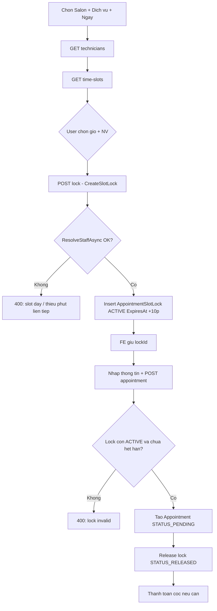
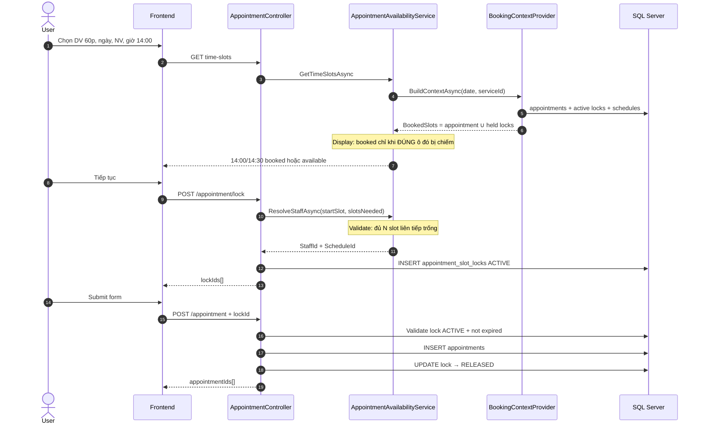
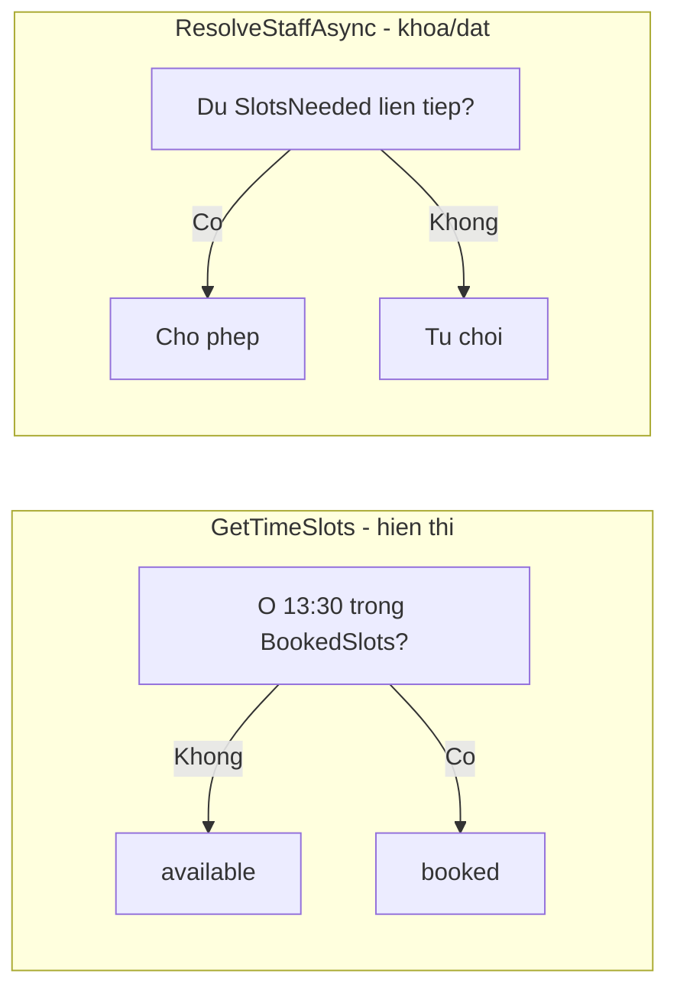
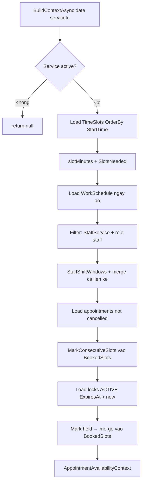
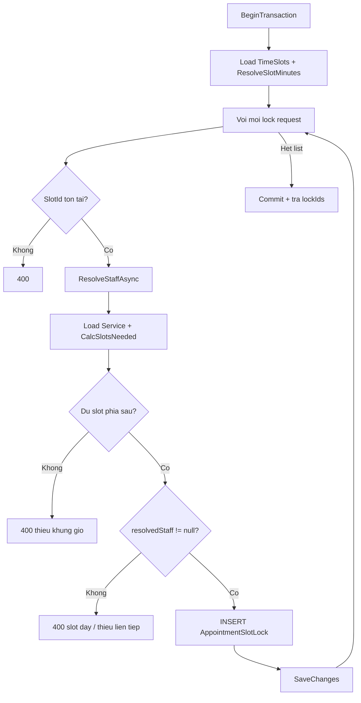
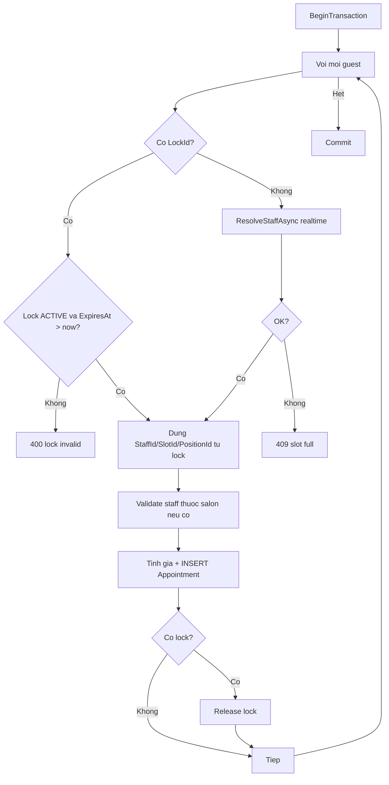
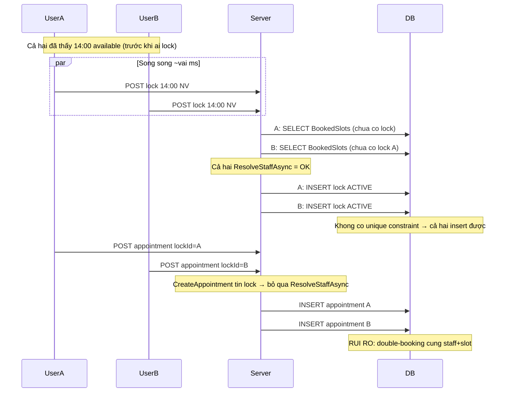

# Booking Slot Lock & Availability — Flow & Race Conditions

Tài liệu bảo trì cho logic đặt lịch online: kiểm tra khung giờ, khóa tạm (`AppointmentSlotLock`), và tạo lịch hẹn.

**Phạm vi code chính**

| Thành phần | File |
|---|---|
| Context (load appointments + locks lên RAM) | `Persistence/.../BookingContextProvider.cs` |
| Availability / Resolve staff | `Helpers/AppointmentAvailabilityService.cs` |
| Khóa slot tạm (~10 phút) | `Appointments/Commands/CreateSlotLock/` |
| Tạo appointment | `Appointments/Commands/CreateAppointment/` |
| API | `API/Controllers/AppointmentController.cs` (`technicians`, `time-slots`, `lock`, `POST`) |

---

## 1. Tổng quan quy trình đặt lịch (FE → BE)



**Ý nghĩa Soft Lock**

- Giữ chỗ **tạm** trong lúc user điền form (tránh người khác thấy slot trống và đặt chồng).
- TTL mặc định **10 phút** (`ExpiresAt = UtcNow + 10m`).
- Sau khi tạo appointment thành công → lock chuyển `RELEASED`.
- Lock hết hạn / không dùng → không còn được tính trong `BookingContextProvider` (`Status == ACTIVE && ExpiresAt > now`).

---

## 2. Sequence — Happy path (có Soft Lock)



---

## 3. Cách tính `SlotsNeeded` và mark ô bị chiếm

### 3.1 Công thức

```text
slotMinutes  = EndTime - StartTime của 1 time_slot trong DB (fallback DEFAULT = 30)
SlotsNeeded  = Ceil(DurationMins / slotMinutes)   // min = 1
```

Ví dụ: DV **60 phút**, slot **30 phút** → `SlotsNeeded = 2`.

Chọn bắt đầu **14:00** → đánh dấu **14:00** và **14:30** (không đánh 13:30).

### 3.2 Ai được phép làm DV / thuộc salon

Trong `BuildContextAsync`:

1. NV có ca trong ngày (`WorkSchedule` active).
2. Có `StaffService` active với `serviceId`.
3. Role user = `staff`.
4. Khi gọi API: lọc thêm theo `salonId` (`StaffSalon` active) trong `AppointmentAvailabilityService`.

### 3.3 Hai tầng status (quan trọng khi bảo trì)

| Tầng | Dùng ở đâu | Rule |
|---|---|---|
| **Display** (`GetTimeSlots`) | Lưới giờ UI | `"booked"` chỉ khi **chính** ô đó có trong `BookedSlots`. Ô 13:30 vẫn `"available"` dù 14:00 đã khóa. |
| **Validate start** (`ResolveStaffAsync` / lock / đếm slot technician) | Khóa & đặt | Phải đủ `SlotsNeeded` ô **liên tiếp** trống + nằm trong ca. DV 60p tại 13:30 khi 14:00 đã khóa → **fail**. |



**Kịch bản mong đợi**

| Tình huống | UI 13:30 | POST lock tại 13:30 |
|---|---|---|
| DV 30p, đã khóa 14:00–14:30 | Trống | Thành công |
| DV 60p, đã khóa 14:00–14:30 | Trống (chọn được) | Lỗi thiếu phút liên tiếp |
| Bất kỳ DV tại 14:00 | Đã đặt | Lỗi |

---

## 4. Flowchart — Build context + check availability



`MarkConsecutiveSlots(staffId, startSlotId, slotsNeeded)`:

1. Tìm `startIndex` theo `SlotId` trong list đã sort theo giờ.
2. Đánh dấu `timeSlots[startIndex .. startIndex + slotsNeeded - 1]`.

---

## 5. Flowchart — CreateSlotLock chi tiết



TTL: `ExpiresAt = UtcNow + 10 minutes`.

---

## 6. Flowchart — CreateAppointment với / không có lock



---

## 7. Race condition — 2 người bấm cách nhau vài ms

### 7.1 Cơ chế hiện tại (optimistic soft-lock)

Hệ thống **không** dùng:

- Unique index `(StaffId, SlotId, AppointmentDate)` trên lock active  
- `UPDLOCK` / `SERIALIZABLE` khi check-then-insert  
- Distributed lock (Redis)  

Mà dùng: **đọc trạng thái → nếu trống thì insert lock** trong transaction isolation mặc định (SQL Server thường là **Read Committed**).

### 7.2 Sequence race (cùng NV + cùng giờ)



### 7.3 Khi nào “ổn”, khi nào “chưa đủ cứng”?

| Tình huống | Hành vi hiện tại | Đánh giá |
|---|---|---|
| B đặt **sau** khi lock của A đã `SaveChanges` và B gọi lại `time-slots` / `lock` | `BuildContext` thấy held slots → B fail `ResolveStaffAsync` | **Ổn** (soft lock phát huy) |
| A và B lock **cùng lúc** (cùng đọc trước khi ai INSERT) | Có thể **hai lock ACTIVE** cùng staff + dải giờ | **Chưa an toàn tuyệt đối** |
| Cả hai tạo appointment bằng `lockId` của mình | Cả hai có thể tạo appointment (không re-check overlap) | **Rủi ro double-book** |
| B chọn **NV khác** / giờ khác | Không đụng held của A | Ổn |
| Mode “Bất kỳ NV” — A và B cùng slot | Có thể resolve về **cùng** staff rảnh nhất | Rủi ro tương tự |
| Lock hết hạn (>10p) rồi đặt | `CreateAppointment` reject lock invalid | Ổn |
| Đặt **không** qua lock (`LockId` null) | Có `ResolveStaffAsync` realtime nhưng vẫn TOCTOU check→insert appointment | Rủi ro nhẹ hơn UI conflict, chưa hard-guarantee |

### 7.4 Kết luận trả lời câu hỏi “2 người cách vài ms có ổn không?”

- **Thường ổn** nếu khoảng cách đủ lớn để lock của người A đã commit trước khi người B check/lock — soft lock 10 phút làm việc tốt cho luồng UI bình thường.  
- **Không đảm bảo 100%** trong cửa sổ race cực ngắn (check song song rồi cả hai insert lock). Code hiện tại là **soft / optimistic concurrency**, chưa phải **hard lock** ở DB.

### 7.5 Hướng củng cố nếu cần hard guarantee (chưa implement)

1. **Unique filtered index** (SQL Server), ví dụ unique trên `(staff_id, appointment_date, slot_id)` where `status = ACTIVE` — hạn chế 2 lock cùng start slot; vẫn cần xử lý overlap multi-slot (`SlotsNeeded > 1`).  
2. Trong `CreateSlotLock`: sau khi BeginTransaction, đọc lại availability với isolation cao hơn / `UPDLOCK` trên bảng lock hoặc bảng “seat”.  
3. Khi `CreateAppointment` **dù có lock**: chạy lại `CanStartServiceHere` (hoặc kiểm tra không có appointment chồng) trước insert.  
4. Unique / exclude constraint trên appointments theo `(staff_id, date, slot range)` nếu DB hỗ trợ.

---

## 8. Giải thích các hàm then chốt

### `BookingContextProvider.BuildContextAsync`

- Load 1 lần: service, time slots, schedules, staff (kèm StaffService), appointments, active locks.  
- `BookedSlots[(staffId, slotId)] = 1` = ô đó không trống.  
- Held locks được **merge** vào cùng dictionary để validate không phân biệt “đã đặt” vs “đang giữ”.

### `AppointmentAvailabilityService`

- `GetTechniciansAsync`: đếm số chỗ **bắt đầu được DV** (`CanStartServiceHere`) → `SlotsLeft`.  
- `GetTimeSlotsAsync`: status lưới theo **ô đơn** (`IsSlotOccupied`).  
- `ResolveStaffAsync`: chốt NV + bắt buộc đủ chuỗi slot; chọn “Bất kỳ” = NV còn nhiều start slot nhất (`ThenBy StaffId` để ổn định).

### `CreateSlotLockHandler`

- Transaction bao quanh insert lock.  
- `SlotsNeeded` tính từ **độ dài slot DB** (không hard-code sai DEFAULT).  
- Message lỗi tách: thiếu phút liên tiếp vs ô đã chiếm.

### `CreateAppointmentHandler`

- Ưu tiên tin `LockId` nếu còn hạn → gán staff/slot từ lock.  
- Release lock sau khi appointment tạo xong.  
- **Lưu ý bảo trì:** có lock hợp lệ → **không** gọi lại `ResolveStaffAsync` → phụ thuộc tính toàn vẹn của soft lock.

---

## 9. Checklist bảo trì nhanh

- [ ] Đổi độ dài slot trong DB → đảm bảo CreateSlotLock và BuildContext cùng `ResolveSlotMinutes`.  
- [ ] Đổi TTL lock → sửa `AddMinutes(10)` trong CreateSlotLock + mô tả FE.  
- [ ] Sửa rule hiển thị booked → đụng `ResolveDisplaySlotStatus*` (không đụng `CanStartServiceHere`).  
- [ ] Sửa rule chặn đặt chồng → đụng `CanStartServiceHere` / `ResolveStaffAsync`.  
- [ ] Nếu production gặp double-book → ưu tiên hardening mục 7.5 trước khi tinh chỉnh UI.

---

## 10. Thuật ngữ

| Thuật ngữ | Nghĩa |
|---|---|
| TimeSlot | Ô giờ cố định trong bảng `time_slots` (vd 14:00–14:30) |
| SlotsNeeded | Số ô liên tiếp cần chiếm cho 1 lần bắt đầu DV |
| Soft Lock | Bản ghi `appointment_slot_locks` tạm, có hết hạn |
| BookedSlots | Map in-memory: appointment + held locks đã chiếm ô nào |
| Display booked | UI: ô đó có trong BookedSlots |
| Can start | Backend: đủ N ô liên tiếp trống để bắt đầu DV |
| TOCTOU | Time-of-check to time-of-use — đọc trống rồi mới ghi, khoảng trống bị race |
