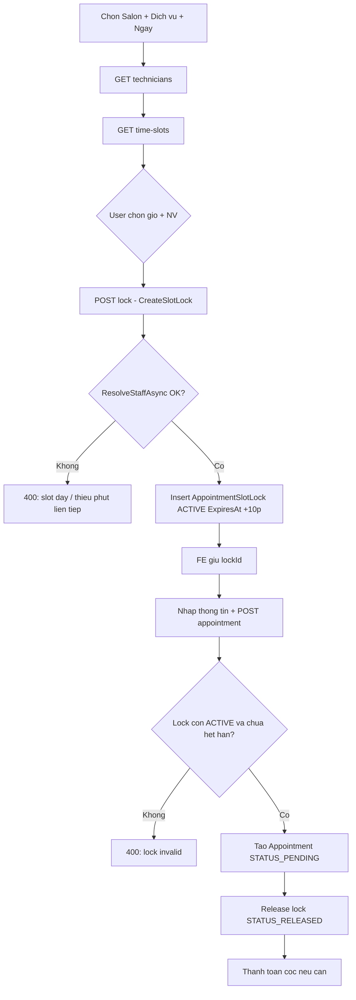
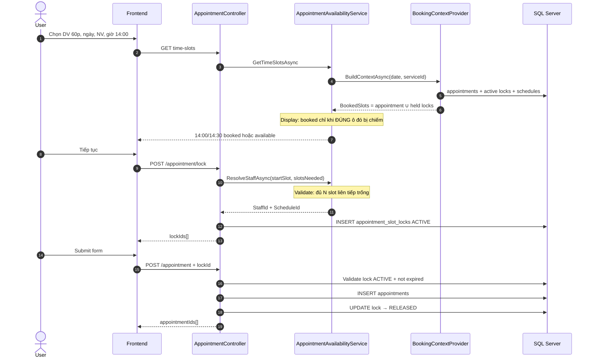
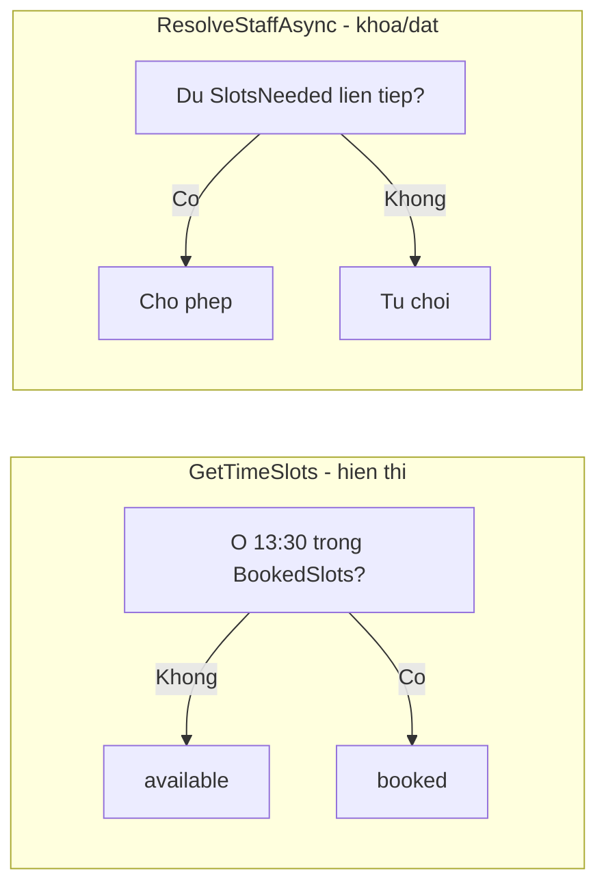
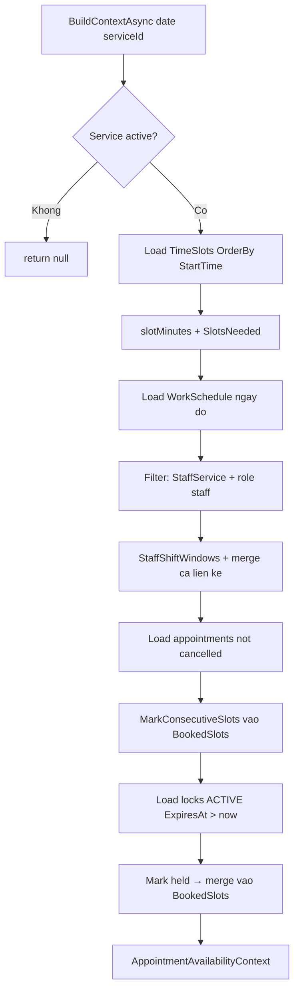
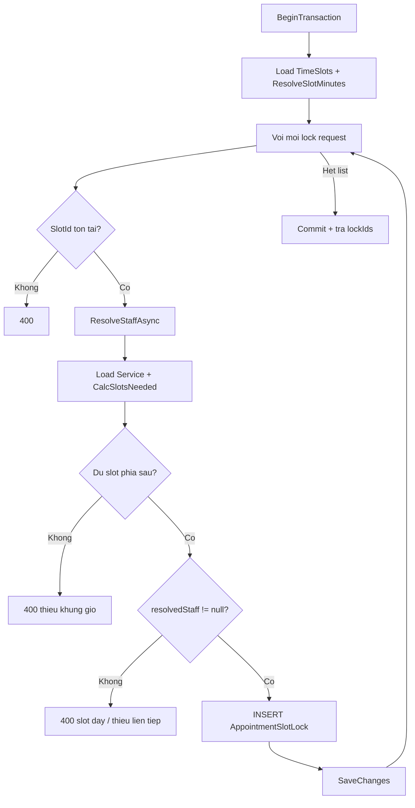
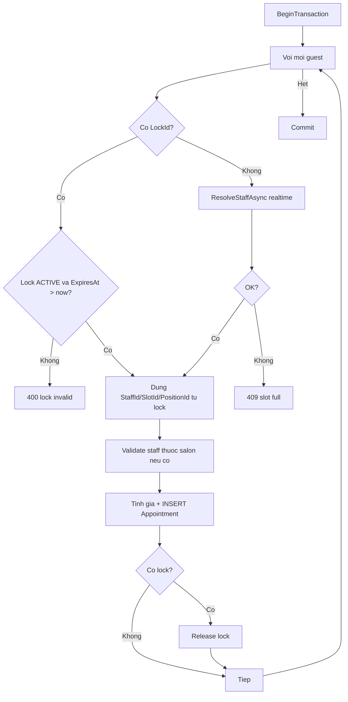
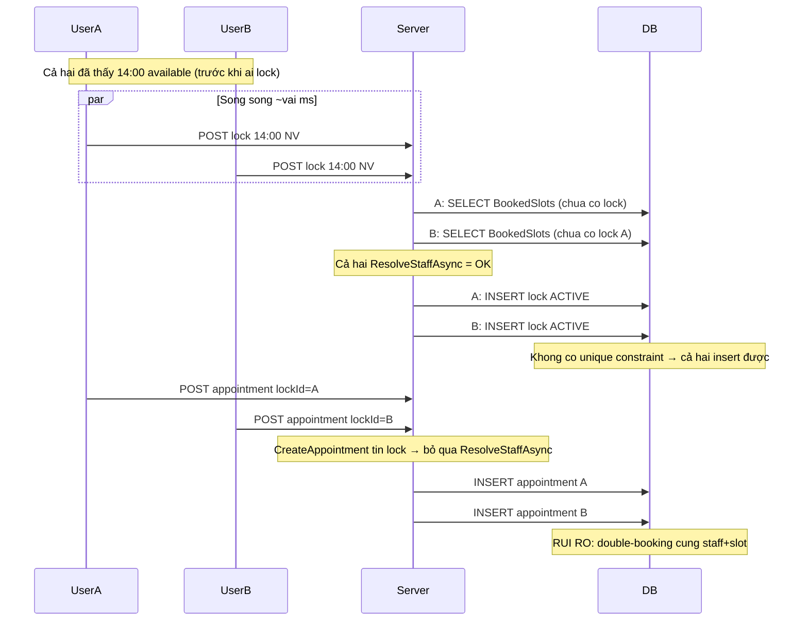
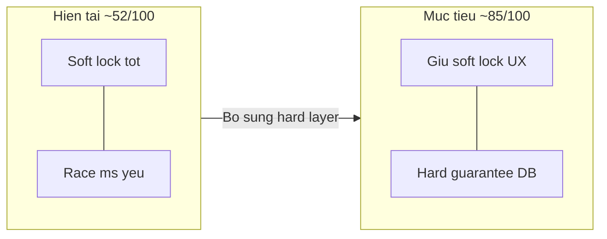

# Booking Slot Lock & Availability — Flow & Race Conditions

Tài liệu bảo trì cho logic đặt lịch online: kiểm tra khung giờ, khóa tạm (`AppointmentSlotLock`), và tạo lịch hẹn.

**Phạm vi code chính**

| Thành phần | File |
|---|---|
| Context (load appointments + locks lên RAM) | `Persistence/.../BookingContextProvider.cs` |
| Availability / Resolve staff | `Helpers/AppointmentAvailabilityService.cs` |
| Khóa slot tạm (~10 phút) | `Appointments/Commands/CreateSlotLock/` |
| Tạo appointment | `Appointments/Commands/CreateAppointment/` |
| API | `API/Controllers/AppointmentController.cs` (`technicians`, `time-slots`, `lock`, `POST`) |

---

## 1. Tổng quan quy trình đặt lịch (FE → BE)



**Ý nghĩa Soft Lock**

- Giữ chỗ **tạm** trong lúc user điền form (tránh người khác thấy slot trống và đặt chồng).
- TTL mặc định **10 phút** (`ExpiresAt = UtcNow + 10m`).
- Sau khi tạo appointment thành công → lock chuyển `RELEASED`.
- Lock hết hạn / không dùng → không còn được tính trong `BookingContextProvider` (`Status == ACTIVE && ExpiresAt > now`).

---

## 2. Sequence — Happy path (có Soft Lock)



---

## 3. Cách tính `SlotsNeeded` và mark ô bị chiếm

### 3.1 Công thức

```text
slotMinutes  = EndTime - StartTime của 1 time_slot trong DB (fallback DEFAULT = 30)
SlotsNeeded  = Ceil(DurationMins / slotMinutes)   // min = 1
```

Ví dụ: DV **60 phút**, slot **30 phút** → `SlotsNeeded = 2`.

Chọn bắt đầu **14:00** → đánh dấu **14:00** và **14:30** (không đánh 13:30).

### 3.2 Ai được phép làm DV / thuộc salon

Trong `BuildContextAsync`:

1. NV có ca trong ngày (`WorkSchedule` active).
2. Có `StaffService` active với `serviceId`.
3. Role user = `staff`.
4. Khi gọi API: lọc thêm theo `salonId` (`StaffSalon` active) trong `AppointmentAvailabilityService`.

### 3.3 Hai tầng status (quan trọng khi bảo trì)

| Tầng | Dùng ở đâu | Rule |
|---|---|---|
| **Display** (`GetTimeSlots`) | Lưới giờ UI | `"booked"` chỉ khi **chính** ô đó có trong `BookedSlots`. Ô 13:30 vẫn `"available"` dù 14:00 đã khóa. |
| **Validate start** (`ResolveStaffAsync` / lock / đếm slot technician) | Khóa & đặt | Phải đủ `SlotsNeeded` ô **liên tiếp** trống + nằm trong ca. DV 60p tại 13:30 khi 14:00 đã khóa → **fail**. |



**Kịch bản mong đợi**

| Tình huống | UI 13:30 | POST lock tại 13:30 |
|---|---|---|
| DV 30p, đã khóa 14:00–14:30 | Trống | Thành công |
| DV 60p, đã khóa 14:00–14:30 | Trống (chọn được) | Lỗi thiếu phút liên tiếp |
| Bất kỳ DV tại 14:00 | Đã đặt | Lỗi |

---

## 4. Flowchart — Build context + check availability



`MarkConsecutiveSlots(staffId, startSlotId, slotsNeeded)`:

1. Tìm `startIndex` theo `SlotId` trong list đã sort theo giờ.
2. Đánh dấu `timeSlots[startIndex .. startIndex + slotsNeeded - 1]`.

---

## 5. Flowchart — CreateSlotLock chi tiết



TTL: `ExpiresAt = UtcNow + 10 minutes`.

---

## 6. Flowchart — CreateAppointment với / không có lock



---

## 7. Race condition — 2 người bấm cách nhau vài ms

### 7.1 Cơ chế hiện tại (optimistic soft-lock)

Hệ thống **không** dùng:

- Unique index `(StaffId, SlotId, AppointmentDate)` trên lock active  
- `UPDLOCK` / `SERIALIZABLE` khi check-then-insert  
- Distributed lock (Redis)  

Mà dùng: **đọc trạng thái → nếu trống thì insert lock** trong transaction isolation mặc định (SQL Server thường là **Read Committed**).

### 7.2 Sequence race (cùng NV + cùng giờ)



### 7.3 Khi nào “ổn”, khi nào “chưa đủ cứng”?

| Tình huống | Hành vi hiện tại | Đánh giá |
|---|---|---|
| B đặt **sau** khi lock của A đã `SaveChanges` và B gọi lại `time-slots` / `lock` | `BuildContext` thấy held slots → B fail `ResolveStaffAsync` | **Ổn** (soft lock phát huy) |
| A và B lock **cùng lúc** (cùng đọc trước khi ai INSERT) | Có thể **hai lock ACTIVE** cùng staff + dải giờ | **Chưa an toàn tuyệt đối** |
| Cả hai tạo appointment bằng `lockId` của mình | Cả hai có thể tạo appointment (không re-check overlap) | **Rủi ro double-book** |
| B chọn **NV khác** / giờ khác | Không đụng held của A | Ổn |
| Mode “Bất kỳ NV” — A và B cùng slot | Có thể resolve về **cùng** staff rảnh nhất | Rủi ro tương tự |
| Lock hết hạn (>10p) rồi đặt | `CreateAppointment` reject lock invalid | Ổn |
| Đặt **không** qua lock (`LockId` null) | Có `ResolveStaffAsync` realtime nhưng vẫn TOCTOU check→insert appointment | Rủi ro nhẹ hơn UI conflict, chưa hard-guarantee |

### 7.4 Kết luận trả lời câu hỏi “2 người cách vài ms có ổn không?”

- **Thường ổn** nếu khoảng cách đủ lớn để lock của người A đã commit trước khi người B check/lock — soft lock 10 phút làm việc tốt cho luồng UI bình thường.  
- **Không đảm bảo 100%** trong cửa sổ race cực ngắn (check song song rồi cả hai insert lock). Code hiện tại là **soft / optimistic concurrency**, chưa phải **hard lock** ở DB.

### 7.5 Hướng củng cố nếu cần hard guarantee (chưa implement)

1. **Unique filtered index** (SQL Server), ví dụ unique trên `(staff_id, appointment_date, slot_id)` where `status = ACTIVE` — hạn chế 2 lock cùng start slot; vẫn cần xử lý overlap multi-slot (`SlotsNeeded > 1`).  
2. Trong `CreateSlotLock`: sau khi BeginTransaction, đọc lại availability với isolation cao hơn / `UPDLOCK` trên bảng lock hoặc bảng “seat”.  
3. Khi `CreateAppointment` **dù có lock**: chạy lại `CanStartServiceHere` (hoặc kiểm tra không có appointment chồng) trước insert.  
4. Unique / exclude constraint trên appointments theo `(staff_id, date, slot range)` nếu DB hỗ trợ.

---

## 8. Giải thích các hàm then chốt

### `BookingContextProvider.BuildContextAsync`

- Load 1 lần: service, time slots, schedules, staff (kèm StaffService), appointments, active locks.  
- `BookedSlots[(staffId, slotId)] = 1` = ô đó không trống.  
- Held locks được **merge** vào cùng dictionary để validate không phân biệt “đã đặt” vs “đang giữ”.

### `AppointmentAvailabilityService`

- `GetTechniciansAsync`: đếm số chỗ **bắt đầu được DV** (`CanStartServiceHere`) → `SlotsLeft`.  
- `GetTimeSlotsAsync`: status lưới theo **ô đơn** (`IsSlotOccupied`).  
- `ResolveStaffAsync`: chốt NV + bắt buộc đủ chuỗi slot; chọn “Bất kỳ” = NV còn nhiều start slot nhất (`ThenBy StaffId` để ổn định).

### `CreateSlotLockHandler`

- Transaction bao quanh insert lock.  
- `SlotsNeeded` tính từ **độ dài slot DB** (không hard-code sai DEFAULT).  
- Message lỗi tách: thiếu phút liên tiếp vs ô đã chiếm.

### `CreateAppointmentHandler`

- Ưu tiên tin `LockId` nếu còn hạn → gán staff/slot từ lock.  
- Release lock sau khi appointment tạo xong.  
- **Lưu ý bảo trì:** có lock hợp lệ → **không** gọi lại `ResolveStaffAsync` → phụ thuộc tính toàn vẹn của soft lock.

---

## 9. Checklist bảo trì nhanh

- [ ] Đổi độ dài slot trong DB → đảm bảo CreateSlotLock và BuildContext cùng `ResolveSlotMinutes`.  
- [ ] Đổi TTL lock → sửa `AddMinutes(10)` trong CreateSlotLock + mô tả FE.  
- [ ] Sửa rule hiển thị booked → đụng `ResolveDisplaySlotStatus*` (không đụng `CanStartServiceHere`).  
- [ ] Sửa rule chặn đặt chồng → đụng `CanStartServiceHere` / `ResolveStaffAsync`.  
- [ ] Nếu production gặp double-book → ưu tiên hardening mục 7.5 trước khi tinh chỉnh UI.

---

## 10. Thuật ngữ

| Thuật ngữ | Nghĩa |
|---|---|
| TimeSlot | Ô giờ cố định trong bảng `time_slots` (vd 14:00–14:30) |
| SlotsNeeded | Số ô liên tiếp cần chiếm cho 1 lần bắt đầu DV |
| Soft Lock | Bản ghi `appointment_slot_locks` tạm, có hết hạn |
| BookedSlots | Map in-memory: appointment + held locks đã chiếm ô nào |
| Display booked | UI: ô đó có trong BookedSlots |
| Can start | Backend: đủ N ô liên tiếp trống để bắt đầu DV |
| TOCTOU | Time-of-check to time-of-use — đọc trống rồi mới ghi, khoảng trống bị race |
| Hard guarantee | DB/engine từ chối trạng thái chồng lịch dù race (unique / serializable / seat row) |
| Soft guarantee | Giảm xác suất chồng nhờ soft lock + check, vẫn còn cửa sổ race |

---

## 11. Đánh giá áp dụng thực tế — tiêu chí Booking System hiện đại

Thang điểm mỗi tiêu chí: **0–10**. Mục tiêu production vừa chịu tải ~**100 user đồng thời** (salon vừa/nhỏ, burst đặt lịch): cần tổng ≥ **80/100** và các tiêu chí “an toàn dữ liệu” ≥ **8/10**.

### 11.1 Bảng điểm hiện tại (as-is)

| # | Tiêu chí (industry / production) | Điểm | Giải thích ngắn |
|---|---|---:|---|
| 1 | Soft hold khi user điền form (TTL) | **8** | Có soft lock 10 phút, merge vào BookedSlots — đúng pattern Calendly/Opentable-style hold. |
| 2 | Validate đủ thời lượng liên tiếp (multi-slot) | **8** | `SlotsNeeded` + `CanStartServiceHere` rõ ràng; đồng bộ độ dài slot DB. |
| 3 | Hiển thị vs validate tách lớp (UX) | **8** | Display theo ô; validate lúc lock/đặt — tránh “ảo khóa” ô trước. |
| 4 | Chống double-book hard (race vài ms) | **4** | Soft check-then-insert; **không** unique/seat lock; `CreateAppointment` tin lockId → TOCTOU còn. |
| 5 | DB constraint / exclusion overlap | **2** | Không filtered unique trên lock active; không exclusion trên appointment range. |
| 6 | Re-validate lúc confirm (dù đã hold) | **3** | Có lock hợp lệ → bỏ qua `ResolveStaffAsync`. |
| 7 | Idempotency / chống double submit FE | **5** | Phụ thuộc FE; BE chưa thấy idempotency key chuẩn. |
| 8 | Isolation / locking strategy tường minh | **4** | Transaction mặc định (thường Read Committed); không UPDLOCK/SERIALIZABLE có chủ đích. |
| 9 | Khả năng chịu tải ~100 concurrent | **6** | Architecture đơn giản ổn cho 100 user; điểm yếu là đúngness under race hơn là CPU. Bottleneck có thể là `BuildContext` load full ngày mỗi request. |
| 10 | Quan sát / phục hồi (monitor double-book, TTL cleanup) | **4** | Có ExpiresAt nhưng chưa thấy job cleanup lock hết hạn + alert chồng lịch. |
| | **Tổng** | **52/100** | Đủ cho demo / luận văn UI flow; **chưa đủ** “production an toàn under concurrent booking”. |

**Tóm tắt mức độ an toàn race:** khoảng **4–5/10** trên trục “data integrity under concurrency”. Soft lock kéo điểm UX và giảm xung đột thực tế, nhưng **không đóng** cửa sổ vài ms.



### 11.2 Đối chiếu nhanh với hệ thống booking “chuẩn”

| Pattern phổ biến | 66SMS hiện tại | Gap |
|---|---|---|
| Hold chỗ TTL | Có | — |
| Atomic reserve (1 winner) | Không | Race insert lock |
| Confirm re-check occupancy | Yếu | Trust lockId |
| Seat / resource row lock | Không | — |
| Overlap constraint | Không | Double appointment |
| Scale read model / cache | In-memory per request | Ổn ~100 nếu tối ưu query |

---

## 12. Mục tiêu vận hành: ~100 người đồng thời + chống race vài ms

### 12.1 Định nghĩa “100 người”

- ~100 session FE / tab đồng thời trong giờ cao điểm.  
- Burst: vài–vài chục `POST /lock` và `POST /appointment` trong cùng vài giây (không phải 100 người cùng 1 slot).  
- Cùng 1 slot + 1 NV: chỉ **1** người thắng; người còn lại nhận lỗi rõ ràng.

### 12.2 Điểm cần đạt sau cải tiến

| Tiêu chí | Hiện tại | Mục tiêu |
|---|---:|---:|
| Chống double-book hard | 4 | **9** |
| Re-validate lúc confirm | 3 | **9** |
| DB constraint | 2 | **8** |
| Chịu tải ~100 concurrent | 6 | **8** |
| Soft hold UX | 8 | **8** (giữ) |
| **Tổng ước lượng** | **52** | **~85–88** |

---

## 13. Đề xuất khắc phục (theo lớp) + Trade-off so với code hiện tại

Ưu tiên thực tế cho đồ án / salon vừa: **lớp A + B trước**, sau đó C nếu cần. Không bắt buộc Redis ngay cho 100 user.

### Lớp A — Hard đảm bảo tại DB (bắt buộc để đóng race ms)

**A1. Filtered unique index trên soft lock (start slot)**

```sql
-- Pseudo: chỉ 1 lock ACTIVE chưa hết hạn / cùng staff + ngày + start slot
CREATE UNIQUE INDEX UX_slot_lock_active_start
ON appointment_slot_locks (staff_id, appointment_date, slot_id)
WHERE status = 1; -- ACTIVE
```

- **Trade-off:** chặn 2 lock cùng **start** slot tốt; với `SlotsNeeded > 1` vẫn có race kiểu A lock 14:00–14:30, B lock 14:30–15:00 nếu chỉ unique start — cần thêm lớp overlap.  
- **So với hiện tại:** + ít code C#, phụ thuộc migration/DB-first script; catch unique violation → trả 409.

**A2. Bảng “seat occupancy” (khuyến nghị cho multi-slot)**

Mỗi lần lock/appointment thành công ghi N dòng `(staff_id, date, slot_id)` với unique `(staff_id, date, slot_id)`.

- Lock 60p @14:00 → insert seats 14:00 + 14:30 trong **một transaction**.  
- User thứ hai insert đụng unique → fail.  
- **Trade-off:** thêm bảng + ghi nhiều hơn; đơn giản hiểu & debug; scale tốt với 100 user.  
- **So với hiện tại:** đổi từ “chỉ nhớ start + SlotsNeeded” sang “materialize từng ô” — khớp đúng `BookedSlots` mentally.

**A3. Re-check overlap khi CreateAppointment (dù có lockId)**

Trước `INSERT appointment`: gọi lại `CanStartServiceHere` **hoặc** thử chiếm seat; fail → 409.

- **Trade-off:** thêm 1 lần đọc/validate; close lỗ “tin lock giả / race hai lock”.  
- **So với hiện tại:** hơi chậm hơn vài ms; đúng hơn rất nhiều.

### Lớp B — Transaction / khóa ngắn (củng cố check-then-insert)

**B1. Trong CreateSlotLock: Serializable hoặc RepeatableRead + re-read**

```text
BeginTran (Serializable)
  BuildContext / query locks+appointments
  if conflict → rollback 409
  INSERT lock (+ seats)
Commit
```

- **Trade-off:** an toàn hơn; dễ **blocking / deadlock** khi burst cùng slot; với 100 user toàn hệ thống thường ổn nếu contention theo (staff, date).  
- **So với hiện tại:** phức tạp vận hành hơn; cần bắt deadlock retry.

**B2. `UPDLOCK, ROWLOCK` trên hàng “staff-date mutex”**

Một hàng mutex `(staff_id, date)` — ai lock slot trong ngày đó phải lấy khóa hàng này trước.

- **Trade-off:** serialize toàn bộ booking của 1 NV/ngày → an toàn, giảm parallelism trên NV hot.  
- **Phù hợp** salon nhỏ (1 NV hot); với 100 user phân tán nhiều NV/slot vẫn ổn.

### Lớp C — Scale đọc / UX (100 concurrent)

| Việc | Lợi ích | Trade-off |
|---|---|---|
| Cache time-slots/technicians ngắn (5–15s) + invalidate khi lock | Giảm load `BuildContext` | Cache stale vài giây — chấp nhận được nếu lock/confirm vẫn hard-check |
| Job cleanup lock `ExpiresAt < now` | Bảng sạch, index hiệu quả | Thêm background job |
| Idempotency-Key trên `POST lock` / `POST appointment` | Chống double-click FE | FE phải gửi key |
| Index `(appointment_date, staff_id, status)` trên appointments & locks | Query nhanh | Cần quản lý index DB-first |

### Lớp D — Không khuyến nghị ngay cho target 100 user

| Option | Khi nào cần | Trade-off |
|---|---|---|
| Redis distributed lock | Nhiều instance API, contention cực cao | Infra phức tạp hơn SQL seat |
| Event sourcing full calendar | Hệ lớn, audit sâu | Over-engineer cho capstone/salon vừa |

---

## 14. Roadmap đề xuất để “áp dụng thực tế”

### Phase 1 — Đóng race vài ms (ưu tiên cao, effort thấp–trung bình)

1. Thêm **seat occupancy table** + unique `(staff_id, work_date, slot_id)`.  
2. `CreateSlotLock`: trong transaction → insert N seats + 1 lock row; bắt unique → 409.  
3. `CreateAppointment`: **luôn** re-validate / giữ seat (kể cả khi có `lockId`); fail → 409.  
4. FE: map 409 → toast “Khung giờ vừa có người đặt”.

**Kỳ vọng:** tiêu chí chống race **4 → ~9**; 2 người cách vài ms → **1 thắng / 1 thua rõ**.

### Phase 2 — Sạch dữ liệu + chịu tải 100 user

1. Job expire/cleanup soft lock + xóa/release seat của lock hết hạn.  
2. Index phục vụ `BuildContext` theo ngày.  
3. Optional cache GET technicians/time-slots TTL ngắn.  
4. Idempotency-Key chống double submit.

**Kỳ vọng:** tổng điểm **~85/100**; burst 100 session ổn nếu DB index đúng.

### Phase 3 — Chỉ khi scale lớn hơn

- Redis / message queue / read replica — **không bắt buộc** cho 100 user.

---

## 15. Trade-off tổng hợp: giữ nguyên vs nâng cấp

| Khía cạnh | Giữ code hiện tại | Nâng cấp Phase 1+2 |
|---|---|---|
| Độ phức tạp code | Thấp — dễ hiểu/bảo trì luận văn | Trung bình — thêm seat + catch unique |
| An toàn race ms | Không đảm bảo | Gần hard guarantee ở DB |
| UX soft hold 10p | Đã có | Giữ nguyên |
| Latency mỗi lock | Thấp | + vài ms (transaction + N insert seat) |
| Hạ tầng | Chỉ SQL hiện có | Chỉ SQL (+ job); chưa cần Redis |
| Double-book production | Rủi ro có thể xảy ra | Coi là bug nếu còn |
| Điểm “production ready” | ~52/100 | ~85/100 |

**Khuyến nghị:** với mục tiêu **thực tế + ~100 user + chặn booking cách nhau vài ms** → **không đủ nếu chỉ soft lock hiện tại**; nên triển khai **Phase 1 (seat unique + re-validate confirm)** là mức tối thiểu đáng giá, trade-off chấp nhận được so với rủi ro double-book.

---

## 16. Checklist chấp nhận (Definition of Done nâng cấp)

- [ ] Hai request `POST /lock` song song cùng `staffId + startSlot` (và overlap multi-slot): chỉ một 201, một 409.  
- [ ] Hai `POST /appointment` với hai `lockId` race (nếu lọt qua): vẫn không tạo được 2 appointment chồng ghế — seat/recheck chặn.  
- [ ] DV 30p @13:30 khi 14:00–14:30 đang giữ: lock OK.  
- [ ] DV 60p @13:30 cùng tình huống: 409 / bad request rõ message.  
- [ ] Load smoke: 100 concurrent GET time-slots + 20 concurrent lock khác slot: p95 chấp nhận được; không deadlock storm.  
- [ ] Job TTL: lock hết hạn không còn chặn seat.

---

## 17. Kết luận ngắn cho báo cáo / luận văn

Hệ thống hiện tại đã có **nền tảng booking đúng hướng** (soft lock TTL, multi-slot, tách display/validate, lọc NV theo dịch vụ/salon) — phù hợp demo và phần lớn luồng người dùng tuần tự.

Trên tiêu chí **an toàn concurrency của booking production**, điểm khoảng **52/100**; tiêu chí chống race cứng chỉ khoảng **4/10**. Để đưa vào vận hành chịu ~**100 user** và **khử double-book khi 2 request cách vài ms**, cần bổ sung **hard guarantee ở DB (seat/unique) + re-validate lúc confirm**, chấp nhận trade-off phức tạp và latency nhỏ để đổi lấy tính đúng đắn dữ liệu.
